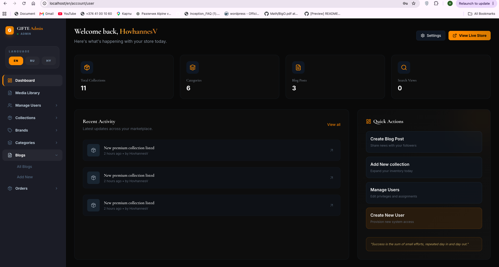

# Gifte Demo

Gifte Demo is the public showcase repository for **Gifte**, a gift-focused ecommerce platform built with Next.js, TypeScript, Node.js, Docker, Prisma, PostgreSQL, Redis queues, AI integration, and an Nginx proxy layer.

This repository is intentionally limited to documentation, architecture, screenshots, and a walkthrough video. It does not contain the private production source code.

## Why This Repo Exists

This repository is designed to show the project clearly without exposing private implementation details.

- It presents the product idea and user experience.
- It explains the system architecture.
- It documents the expected database structure.
- It shares a Loom walkthrough for quick review.
- It keeps secrets, private code, and production logic out of the public repo.

## Recommended Repository Setup

```text
GitHub
  ├── gifte        PRIVATE  -> full real project code
  └── gifte-demo   PUBLIC   -> demo, architecture, docs, screenshots
```

## Loom Walkthrough

Watch the demo video:

<div>
  <a href="https://www.loom.com/share/9f17455eef0549e384515014eff34dd7">
    <p>localhost - 29 June 2026 - Watch Video</p>
  </a>
  <a href="https://www.loom.com/share/9f17455eef0549e384515014eff34dd7">
    
  </a>
</div>

## Project Overview

Gifte is an ecommerce website for discovering and buying gifts by occasion, recipient, category, and budget. The product is focused on making gift shopping faster and more personal through curated collections, clear product pages, cart management, checkout flow, admin product management, background jobs, and AI-assisted ecommerce features.

## Core Features

- Gift discovery by occasion, recipient, category, and price.
- Featured product collections on the home page.
- Product listing and filtering.
- Product detail pages with image, description, price, and actions.
- Shopping cart with quantity updates and item removal.
- Checkout flow for customer and order details.
- Admin dashboard for managing ecommerce content.
- AI integration for smarter product and gift discovery workflows.
- Queue-based background processing with BullMQ and Redis.
- Dockerized development and deployment setup.
- Responsive UI for desktop and mobile.

## Screenshots

### Main Storefront


### Admin Dashboard



## Tech Stack

| Area | Stack |
| --- | --- |
| Frontend | Next.js, React, TypeScript |
| Styling | Tailwind CSS |
| Backend | Node.js, TypeScript |
| ORM | Prisma ORM |
| Database | PostgreSQL |
| Queues | BullMQ |
| Queue Broker | Redis |
| AI | AI integration for ecommerce assistance and automation |
| Containers | Docker, Docker Compose |
| Proxy | Nginx reverse proxy |

## Architecture

Gifte follows a full-stack ecommerce architecture with a Next.js frontend, a Node.js API layer, Prisma ORM, PostgreSQL, Redis-backed queues, AI service integration, Docker Compose orchestration, and Nginx reverse proxy routing.

```text
Customer
   |
   v
Nginx Reverse Proxy
   |
   v
Next.js Frontend
   - Storefront
   - Product pages
   - Cart and checkout UI
   - Admin dashboard
   |
   v
Node.js TypeScript API
   - Product logic
   - Cart and order logic
   - Admin logic
   - AI integration
   |
   +--> Prisma ORM
   |       |
   |       v
   |   PostgreSQL
   |
   +--> BullMQ Workers
           |
           v
        Redis
```

More details are available in:

- [Architecture Diagram](./docs/architecture.md)
- [Database Schema](./docs/database-schema.md)
- [System Flow](./docs/system-flow.md)

## Folder Structure

```text
gifte-demo/
  README.md
  .env.example
  docs/
    architecture.md
    database-schema.md
    system-flow.md
  screenshots/
    gifte_main.png
    gifte_admin.png
    README.md
```

## Environment Variables

This public repository includes only `.env.example`. It shows the expected environment variable structure without exposing secrets.

```bash
cp .env.example .env
```

Never commit real API keys, database URLs, payment keys, or private tokens.

## What Is Not Included

- Production source code.
- Private business logic.
- Real database credentials.
- Payment provider secrets.
- Customer data.
- Admin credentials.

## Status

This repository is a public demo and documentation package. The real implementation should stay in the private `gifte` repository.
